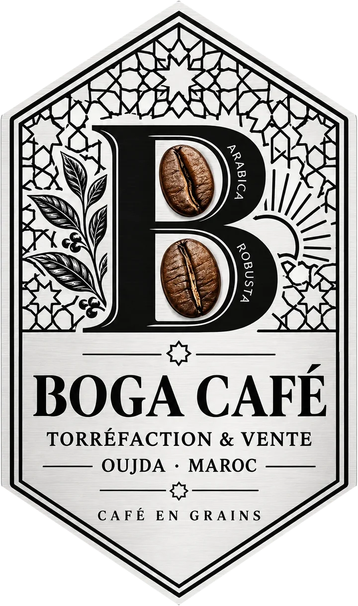
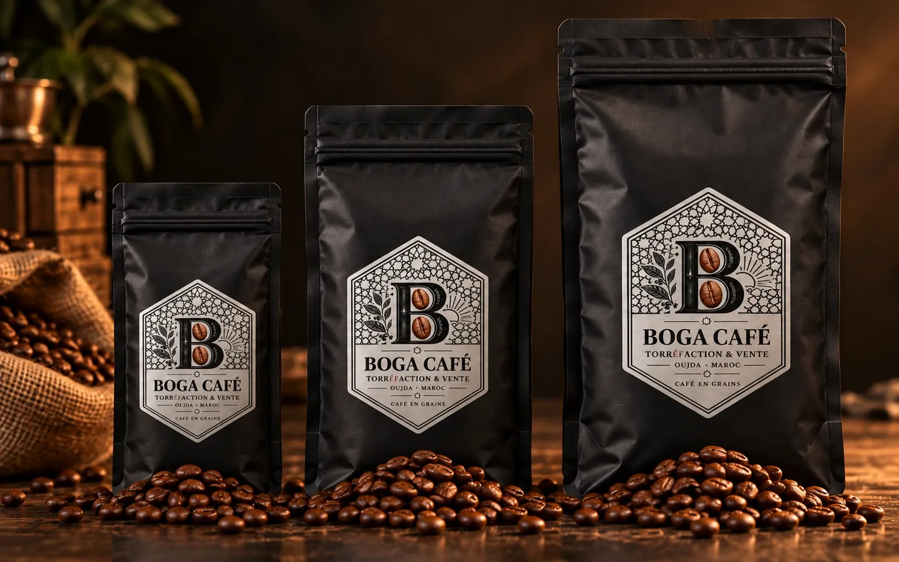
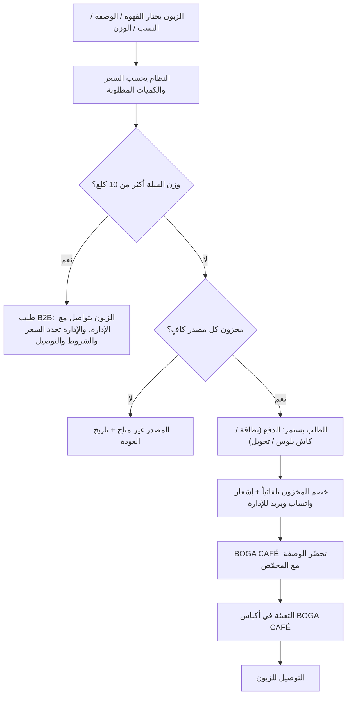

<p align="center">
  
</p>

<h1 align="center">BOGA CAFÉ</h1>

<p align="center">
  <strong>Torréfaction & vente · Oujda, Maroc</strong><br />
  Café en grains · Café doux, sensationnel et savoureux
</p>

<p align="center">
  الموقع الرسمي لعلامة القهوة <strong>BOGA CAFÉ</strong>: واجهة العلامة، متجر إلكتروني لقهوة الحبوب،<br />
  نظام الخلطة الخاصة (Custom Blend)، قسم المهنيين B2B / HORECA، ولوحة إدارة كاملة.<br />
  بثلاث لغات: العربية · Français · English
</p>

---

## المحتويات

1. [فكرة المشروع](#1-فكرة-المشروع)
2. [الزبائن](#2-الزبائن)
3. [المنتجات](#3-المنتجات)
4. [الخلطة الخاصة Custom Blend](#4-الخلطة-الخاصة-custom-blend)
5. [المهنيون B2B / HORECA](#5-المهنيون-b2b--horeca)
6. [الطلب، الدفع، التوصيل، الإشعارات](#6-الطلب-الدفع-التوصيل-الإشعارات)
7. [مسار الطلب من البداية للنهاية](#7-مسار-الطلب-من-البداية-للنهاية)
8. [صفحات الموقع](#8-صفحات-الموقع)
9. [لوحة الإدارة والصلاحيات](#9-لوحة-الإدارة-والصلاحيات)
10. [حالة المشروع وخارطة الطريق](#10-حالة-المشروع-وخارطة-الطريق)
11. [التقنيات](#11-التقنيات)
12. [تنظيم الكود](#12-تنظيم-الكود)
13. [التشغيل والتجربة](#13-التشغيل-والتجربة)
14. [الخدمات الخارجية](#14-الخدمات-الخارجية)
15. [الوثائق التفصيلية](#15-الوثائق-التفصيلية)
16. [En bref · In short](#16-en-bref--in-short)

---

## 1. فكرة المشروع

**BOGA CAFÉ علامة قهوة مغربية من وجدة** هدفها بيع القهوة تحت اسمها وهويتها.

- **BOGA CAFÉ تحدد** الوصفات، الخلطات، النسب، ومواصفات كل منتج.
- **المحمّص / المصنع الشريك** يحمّص وينتج القهوة حسب هذه المواصفات بالضبط.
- القهوة تُعبّأ في **أكياس BOGA CAFÉ** (الكيس الأسود بالملصق الفضي السداسي) وتُباع تحت العلامة.
- الموقع هو **الحضور الرسمي الكامل** للعلامة على الإنترنت: الهوية، عرض المنتجات، البيع، B2B، التواصل، الشبكات الاجتماعية، ولوحة الإدارة.

<p align="center">
  
</p>

> **الرؤية:** موقع واحد رسمي يمثل العلامة، ويعمل في نفس الوقت كمتجر إلكتروني ونظام للزبائن العاديين والمهنيين.
> العلامة + المنتجات + Single Origin + Custom Blend + B2B/HORECA + 3 خلطات B2B + العيّنات + الطلبات + الدفع + التوصيل + المخزون + إشعارات واتساب والبريد + الشبكات الاجتماعية + لوحة الإدارة.

## 2. الزبائن

| النوع | من هو | كيف يشتري |
|---|---|---|
| **B2C** | زبون عادي | يطلب عبر الموقع ويدفع مباشرة، حتى 10 كلغ |
| **B2B** | مقهى، فندق، مطعم، شركة، **أو أي شخص يطلب أكثر من 10 كلغ** | يتواصل مع الإدارة التي تحدد السعر النهائي حسب الكمية والمسافة والمدينة والشروط |

## 3. المنتجات

- **حبوب كاملة فقط** (لا توجد قهوة مطحونة).
- **الأحجام:** 250 غ · 500 غ · 1 كلغ.
- **معلومات كل منتج:** نسبة أرابيكا ونسبة روبوستا، درجة التحميص، النكهات، المصدر، الوزن، السعر.
- **لكل وصفة / خلطة سعرها الخاص** لكل حجم.
- **ثلاثة أنواع من المنتجات:**
  - **الخلطات المميزة** (Signature blends) للجميع.
  - **Single Origin:** قهوة من مصدر واحد حسب التوفر.
  - **خلطات B2B الثلاث** (HORECA) الظاهرة للجميع.
- **المخزون يُحسب بالكيلوغرام، مستقل لكل مصدر** (البرازيل، هندوراس، فيتنام…)، ويُخصم تلقائياً مع كل طلب.

## 4. الخلطة الخاصة Custom Blend

الزبون يركّب وصفته بحرية كاملة:

1. يختار **أنواع القهوة**.
2. يحدد **نسبة كل نوع**، ويجب أن يكون **المجموع 100%**.
3. يختار **الوزن**: 250 غ أو 500 غ أو 1 كلغ.

الموقع **يحسب السعر مباشرة** حسب المكونات والنسب والوزن، ويعرض الغرامات لكل مصدر.

**مرتبطة بالمخزون.** مثال لكيس 1 كلغ:

| المصدر | النسبة | الكمية المخصومة من مخزونه |
|---|---|---|
| كولومبيا | 50% | 500 غ |
| البرازيل | 30% | 300 غ |
| روبوستا | 20% | 200 غ |

- إذا لم يكفِ مخزون مصدر ما، **يُمنع استعماله** في الخلطة ويظهر **تاريخ العودة المتوقع**.
- **الزبون لا يختار درجة التحميص**: كل مصدر يُحمّص بدرجته المرجعية، وأي طلب تعديل يمر عبر الإدارة.
- BOGA CAFÉ تعيد إنتاج الوصفة كما اختارها الزبون.

## 5. المهنيون B2B / HORECA

- **3 خلطات B2B** لكل واحدة وصفتها ومعلوماتها وسعرها (الوصفات يمكن أن تتغير مع الوقت).
- **عيّنة 500 غ:** المهني يرسل معلوماته الشخصية و/أو معلومات مؤسسته، فيصل الطلب مباشرة إلى لوحة الإدارة. **الزبون يدفع التوصيل**، و**BOGA CAFÉ تقرر** إن كانت العيّنة مجانية.
- **كل طلب يفوق 10 كلغ يصبح B2B** حتى لو كان من شخص عادي: السلة تمنع الدفع، وتقترح التواصل عبر واتساب أو إرسال السلة كطلب يصل للإدارة. الإدارة تحدد السعر النهائي والشروط والتوصيل.

## 6. الطلب، الدفع، التوصيل، الإشعارات

| الموضوع | القاعدة |
|---|---|
| **الدفع** | **لا يوجد دفع عند الاستلام.** الطرق: بطاقة بنكية (CMI)، كاش بلوس، تحويل بنكي، وطرق أخرى يمكن إضافتها مستقبلاً. كل الأموال تصل إلى **الحساب البنكي الرسمي لـ BOGA CAFÉ** |
| **صفحة الدفع** | **صفحة واحدة (One-Page Checkout)**، بدون حاجة لإنشاء حساب. حسابات الزبائن قد تُضاف لاحقاً |
| **التوصيل** | لكل مدن المغرب. التكلفة حسب **المدينة والمسافة والكمية**، وتُحدّد وتُعدّل من لوحة الإدارة |
| **واتساب** | مع كل طلب جديد وكل طلب عيّنة، تصل الإدارة رسالة واتساب بالمعلومات الأساسية |
| **البريد** | إشعارات على حساب **Gmail** في البداية، وبريد مهني لاحقاً |
| **التواصل** | Instagram · TikTok · Facebook · WhatsApp · Gmail |

## 7. مسار الطلب من البداية للنهاية



## 8. صفحات الموقع

| الصفحة | الرابط | المحتوى |
|---|---|---|
| الرئيسية | `/` | العلامة، الخلطات المميزة، الخلطة الخاصة، المصادر، مراحل الطلب، B2B، من نحن، الشبكات |
| المتجر | `/shop` | كل المنتجات مع تصفية حسب النوع |
| صفحة المنتج | `/product/:slug` | الوصفة بالأعلام، أرابيكا/روبوستا، التحميص، النكهات، الأحجام والأسعار، التوفر |
| أحادي المصدر | `/single-origin` | المصادر وتوفرها |
| الخلطة الخاصة | `/custom-blend` | 3 خطوات + ملخص حي بالسعر والغرامات |
| المهنيون | `/b2b` | الخلطات الثلاث، القواعد، طلب عيّنة، تواصل للطلبات الكبيرة |
| السلة | `/cart` | مقياس الوزن حتى 10 كلغ، فحص المخزون، مسار B2B |
| الدفع | `/checkout` | صفحة واحدة: المعلومات، طريقة الدفع، الملخص وتكلفة التوصيل |
| الطلب | `/order/:id` | الدفع، التعليمات، تتبع الحالة |
| اتصل بنا | `/contact` | واتساب، البريد، العنوان، الشبكات |

## 9. لوحة الإدارة والصلاحيات

لوحة الإدارة (`/admin`) هي نظام التسيير المركزي: المنتجات، الخلطات، المخزون، الطلبات، B2B، التوصيل، الدفع، والمحتوى، **بدون تعديل الكود** في العمل اليومي.

| القسم | ما يُدار فيه |
|---|---|
| لوحة القيادة | طلبات جديدة، قيد المعالجة، مكتملة، طلبات العيّنات، مدفوعات للتحقق، المخزون، المخزون المنخفض، المداخيل |
| الطلبات | معلومات الزبون، المنتجات، **نسب الخلطة والغرامات لكل مصدر**، الوزن، السعر، التوصيل، الدفع، الحالة، السجل |
| المهنيون والعيّنات | طلبات عيّنة 500 غ (القرار: مجانية أو على حساب الزبون) وطلبات أكثر من 10 كلغ (السعر النهائي) |
| المنتجات والخلطات | إضافة، تعديل، إخفاء، حذف · 3 لغات · الوصفة · التحميص · النكهات · الأسعار حسب الحجم |
| المخزون والمصادر | المخزون بالكيلو لكل مصدر، إضافة/خصم مع السبب، سجل الحركات، تفعيل/إيقاف المصدر في الخلطة الخاصة، تاريخ العودة |
| التوصيل | سعر كل مدينة، الكيلوغرامات المشمولة، سعر الكيلو الإضافي، المدة، حاسبة التكلفة |
| المدفوعات | تفعيل الطرق، التعليمات للزبون، الحساب البنكي الرسمي، التحقق من كاش بلوس والتحويلات |
| الإشعارات | رقم واتساب وبريد الإدارة، وسجل الرسائل المرسلة |
| المحتوى | نصوص الموقع بثلاث لغات، روابط التواصل |
| الإعدادات | حد B2B (10 كلغ)، قواعد الخلطة الخاصة، رسوم الكيس، نسبة فقد التحميص، الأدوار والصلاحيات |

| الدور | الوصول |
|---|---|
| **المالك** | كل شيء |
| **المسيّر** | كل شيء ما عدا المدفوعات والإعدادات |
| **الموظف** | لوحة القيادة، الطلبات، المهنيون، المخزون (دون تغيير الأسعار) |

## 10. حالة المشروع وخارطة الطريق

| المرحلة | المحتوى | الحالة |
|---|---|---|
| 0 | تحضير المعلومات الحقيقية، الحسابات، البنك، طلب CMI | ⏳ عند صاحب المشروع |
| 1 | **النموذج الكامل**: كل الصفحات، الخلطة الخاصة، B2B، الدفع، لوحة الإدارة، 3 لغات، مخطط قاعدة البيانات | ✅ مكتملة |
| 2 | قاعدة البيانات الحقيقية (Supabase)، تسجيل دخول الإدارة، النشر على الإنترنت | التالية |
| 3 | الدفع الحقيقي: CMI بالبطاقة، رفع وصل كاش بلوس/التحويل، إلغاء الطلبات غير المدفوعة | |
| 4 | الإشعارات الحقيقية: WhatsApp Cloud API + Gmail | |
| 5 | الصور والنصوص النهائية، الصفحات القانونية، SEO | |
| 6 | الاختبار الكامل والإطلاق | |
| 7 | حسابات الزبائن، الفواتير PDF، تتبع دفعات التحميص، تتبع الشحن | |

**النموذج الحالي يعمل بالكامل ببيانات تجريبية.** المتبقي هو الربط بالخدمات الخارجية. التفاصيل: [`docs/05-roadmap.md`](docs/05-roadmap.md).

> المنتجات والأسعار والمخزون والأرقام وروابط التواصل الموجودة حالياً **أمثلة** تُستبدل بالمعلومات الحقيقية (من لوحة الإدارة أو من `src/data/seed`).

## 11. التقنيات

| الطبقة | التقنية |
|---|---|
| الواجهة | React 19 · TypeScript · Vite · React Router |
| التصميم | CSS بمتغيرات (tokens) وخصائص منطقية لدعم العربية RTL تلقائياً · المتجر بألوان «الكيس الأسود» · حركة هادئة مع السكرول بـ CSS فقط، تحترم إعداد تقليل الحركة |
| اللغات | قواميس TypeScript للعربية والفرنسية والإنجليزية (نسيان ترجمة = المشروع يرفض البناء) |
| منطق الأعمال | `src/core` بـ TypeScript خالص: نفس الكود في المتصفح وفي الخادم |
| الإنتاج | Supabase: PostgreSQL + أمان على مستوى الصفوف (RLS) + Auth + Storage + Edge Functions |
| الاستضافة | Cloudflare Pages (أو Vercel Pro) |
| الاختبارات | Vitest (19 اختباراً) · اختبار قاعدة البيانات على PostgreSQL (6 اختبارات) · CI على GitHub Actions |

**الأمان:** الأسعار والمخزون يُعاد حسابها في الخادم دائماً، والمخزون يُخصم بعملية ذرّية تمنع بيع نفس الكيلو مرتين، وكل دور لا يرى إلا ما يخصه. التفاصيل: [`docs/03-architecture.md`](docs/03-architecture.md).

## 12. تنظيم الكود

المشروع مقسّم بحيث **يُعدّل كل قسم وحده** دون لمس الأقسام الأخرى.

```
src/
  core/          منطق الأعمال: الأسعار، الخلطة، المخزون، السلة، التوصيل، الطلب + الاختبارات
  data/          البيانات: التجريبية الآن (seed + store)، Supabase في المرحلة 2
  services/      الدفع والإشعارات كمحوّلات قابلة للاستبدال
  i18n/          العربية / الفرنسية / الإنجليزية
  shared/        مكونات مشتركة: صورة المنتج وملصقه، سجل الصور، الأعلام، الرأس، التذييل
  features/      الأقسام، كل قسم في مجلده
    home/ shop/ product/ single-origin/ custom-blend/ b2b/ cart/ checkout/ contact/
    admin/       dashboard/ orders/ b2b/ products/ stock/ shipping/ payments/ notifications/ content/ settings/
  styles/        الألوان والخطوط
supabase/        مخطط قاعدة البيانات للإنتاج + اختباره
docs/            التحليل والدراسة والخطة
```

أين يوجد كل شيء وكيف تعدّله: [`docs/06-modules.md`](docs/06-modules.md).

## 13. التشغيل والتجربة

```bash
npm install
npm run dev          # تشغيل محلي على http://localhost:5173
npm test             # اختبارات منطق الأعمال
npm run typecheck    # فحص الأنواع
npm run build        # نسخة الإنتاج ← dist/
npm run build:demo   # النموذج في ملف HTML واحد يفتح مباشرة في المتصفح ← dist-demo/index.html
./supabase/tests/run-local.sh   # اختبار قاعدة البيانات (يتطلب PostgreSQL)
```

**لوحة الإدارة:** `/admin` · كلمة المرور التجريبية: `boga2026` (اختر الدور: مالك، مسيّر، موظف).

**سيناريوهات للتجربة:**

1. **الخلطة الخاصة:** غيّر النسب وتابع السعر والغرامات. جرّب مجموعاً غير 100%. لاحظ أن «إثيوبيا» غير متاحة مع تاريخ العودة.
2. **طلب كامل:** أضف منتجاً ← السلة ← الدفع (رقم مثل `0612345678`) ← الدفع بالبطاقة (محاكاة).
3. **الإدارة:** افتح «الطلبات»: طلبك مع الغرامات لكل مصدر والمخزون المحجوز. غيّر الحالة أو ألغِ الطلب وتابع عودة المخزون.
4. **الإشعارات:** رسالة واتساب والبريد التي وصلت للإدارة.
5. **قاعدة 10 كلغ:** أضف 11 كيس 1 كلغ ← السلة تحوّلك لمسار B2B.
6. **العيّنة:** أرسل طلب عيّنة من صفحة B2B ← يظهر في «المهنيون والعيّنات».
7. **الأدوار:** ادخل كـ «موظف»: لا مدفوعات، لا إعدادات، لا تغيير للأسعار.
8. **اللغات:** بدّل إلى العربية: كل الصفحات والإدارة من اليمين لليسار.

## 14. الخدمات الخارجية

| الحاجة | الخدمة |
|---|---|
| الكود | GitHub |
| قاعدة البيانات والخادم | Supabase |
| الاستضافة | Cloudflare Pages |
| الدفع بالبطاقة | CMI عبر البنك (أو بوابة دفع مغربية أخرى بعد المقارنة) |
| الدفع نقداً | Cash Plus |
| إشعارات واتساب | WhatsApp Cloud API (Meta Business) |
| إشعارات البريد | Gmail (SMTP) ثم بريد مهني |
| التوصيل | Amana، CTM Messagerie، أو شركات توصيل التجارة الإلكترونية |
| القياس | Google Search Console، Google Analytics أو Plausible |

التفاصيل والتكاليف التقريبية: [`docs/04-services.md`](docs/04-services.md).

## 15. الوثائق التفصيلية

| الوثيقة | المحتوى |
|---|---|
| [01 · تحليل التقرير](docs/01-analysis.md) | كل متطلب ← أين طُبّق، والقرارات عند الغموض |
| [02 · دراسة الفكرة](docs/02-study.md) | التجاري، التشغيلي، القانوني، المالي، التسويق، المخاطر |
| [03 · البنية التقنية](docs/03-architecture.md) | التقنيات، المخططات، الأمان |
| [04 · المواقع والخدمات](docs/04-services.md) | كل خدمة: لماذا، متى، التكلفة |
| [05 · خطوات البناء](docs/05-roadmap.md) | المراحل 0 → 7 وشروط الإنهاء |
| [06 · دليل الأقسام](docs/06-modules.md) | كيف تعدّل كل قسم |
| [07 · أسئلة مفتوحة](docs/07-open-questions.md) | ما ينتظر قرار صاحب المشروع |
| [08 · الصور والهوية البصرية](docs/08-visual-assets.md) | الأصول المعتمدة، المرفوضة، وقواعد طلب صور جديدة |
| [التقرير الأصلي](docs/source/BOGA_CAFE_Project_Website_Concept.docx) | Project & Website Concept |

## 16. En bref · In short

**FR :** BOGA CAFÉ est une marque de café d'Oujda. Elle définit ses recettes et spécifications ; un torréfacteur partenaire produit selon ce cahier des charges ; le café est conditionné dans les sachets BOGA CAFÉ et vendu **en grains uniquement** (250 g, 500 g, 1 kg). Le site réunit : boutique, Single Origin, **Custom Blend** relié au stock de chaque origine (en kg), B2B/HORECA (3 blends, échantillon de 500 g, commandes de plus de 10 kg traitées par l'administration), paiement sans contre-remboursement (carte CMI, Cash Plus, virement), livraison dans tout le Maroc, notifications WhatsApp et Gmail, et un Panel Admin complet. Trois langues : arabe, français, anglais.

**EN:** BOGA CAFÉ is a coffee brand from Oujda, Morocco. It owns the recipes and specifications, a partner roaster produces to spec, and the coffee is sold in BOGA CAFÉ bags as **whole beans only**. This repository contains the full website: shop, single origins, a **Custom Blend** builder tied to per-origin stock in kg, B2B/HORECA with sample requests and a 10 kg B2B threshold, one-page checkout without cash on delivery, delivery across Morocco, WhatsApp and email notifications, and an admin panel with roles. Phase 1 (working prototype on sample data) is complete; the next phases connect Supabase, the CMI payment gateway and the WhatsApp/Gmail notifications.

---

<p align="center">© BOGA CAFÉ · Oujda, Maroc · جميع الحقوق محفوظة. مستودع خاص.</p>
