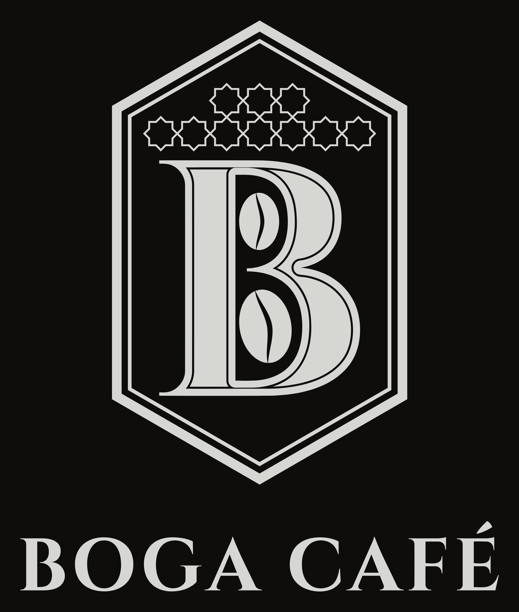

<p align="center">
  
</p>

# BOGA CAFÉ · دليل الشعار

هذا المجلد يحتوي **الشعار الرسمي بصيغة متجهية احترافية** وكل الملفات الجاهزة للموقع والطباعة ومواقع التواصل.
الشعار مبني هندسياً من الصفر (وليس مرسوماً آلياً من صورة)، لذلك يبقى حاداً بأي حجم: من أيقونة 16 بكسل إلى لافتة المحل.

## 1. مكوّنات الشعار

| العنصر | البناء |
|---|---|
| **السداسي** | سداسي منتظم بزوايا 30° بالضبط، مُمدّد عمودياً، بإطار مزدوج (خط سميك + خط رفيع) |
| **حرف B** | خط Cinzel Bold (رخصة SIL OFL الحرة)، بخط محفور داخله (inline) |
| **حبّتا القهوة** | بيضاوي بشق على شكل S، كل حبة بأكبر حجم يدخل فراغ الحرف بهامش ثابت |
| **الزليج** | شبكة «النجمة والصليب» المغربية (نجوم ثمانية تتلامس رؤوسها)، نجوم كاملة فقط، في تاج السداسي |
| **الاسم** | BOGA CAFÉ بخط Cinzel Bold، والشعار الفرعي TORRÉFACTION & VENTE · OUJDA بخط Montserrat SemiBold |

كل الأشكال **مسارات مملوءة** (بدون خطوط stroke، بدون أقنعة، بدون خطوط مدمجة)، ومكتوبة **بمنحنيات Bézier** نظيفة: تُفتح وتُعدّل مباشرة في Illustrator أو Figma أو Inkscape، وتصلح للقصّ بالليزر والتطريز والطباعة الحرارية.

## 2. النسخ المتوفرة

| النسخة | الملف | متى تُستعمل |
|---|---|---|
| **الشعار الرئيسي** (السداسي + الزليج + الاسم) | `logo/svg/boga-cafe-logo.svg` | الأكياس، الملصقات، الواجهة، الفواتير |
| الرئيسي + الشعار الفرعي | `logo/svg/boga-cafe-logo-tagline.svg` | اللافتة، الوثائق الرسمية، البطاقات المهنية |
| **الأيقونة** (السداسي + B + الحبتان) | `logo/svg/boga-cafe-monogram.svg` | الأختام، الأكواب، الأماكن المربعة |
| الأيقونة المبسّطة (بدون الخط المحفور) | `logo/svg/boga-cafe-monogram-small.svg` | **أقل من 48 بكسل**: أيقونة المتصفح، التطبيقات |
| **الأفقي** (الأيقونة + الاسم) | `logo/svg/boga-cafe-horizontal.svg` | رأس الموقع، التوقيع البريدي، الشرائط العريضة |
| فضي على أسود | `*-silver-on-black.svg` | الخلفيات الداكنة، المعاينة |
| بلون النص (`currentColor`) | `*-currentcolor.svg` | الموقع: يأخذ لون العنصر الذي يحتويه |

**ملفات PNG جاهزة** (خلفية شفافة أو سوداء) في `logo/png/`.

### مواقع التواصل (`social/`)

| الملف | الاستعمال |
|---|---|
| `profile-1080.png` | **صورة الحساب** على Instagram و TikTok و WhatsApp Business (آمنة للقص الدائري) |
| `og-image-1200x630.png` | الصورة التي تظهر عند مشاركة رابط الموقع على WhatsApp و Facebook |
| `app-icon.svg` | مصدر أيقونة الهاتف `public/apple-touch-icon.png` |

## 3. الألوان

| اللون | HEX | RGB | CMYK (تقريبي) | الطباعة |
|---|---|---|---|---|
| **أسود BOGA** (الأكياس، الخلفيات) | `#0E0D0C` | 14 · 13 · 12 | 60 · 50 · 50 · 100 (أسود غني) | Pantone Black 6 C |
| **حبر الشعار** (على الأبيض) | `#141312` | 20 · 19 · 18 | 0 · 0 · 0 · 100 | Pantone Black 6 C |
| **فضي BOGA** | `#D6D6D3` | 214 · 214 · 211 | 0 · 0 · 2 · 18 | **Pantone 877 C** (فضي معدني) أو **تذهيب حراري فضي** |
| **نحاسي** (لون ثانوي للموقع فقط) | `#C99A66` | 201 · 154 · 102 | 0 · 30 · 55 · 20 | Pantone 7510 C |

- على الأكياس: **الشعار بالفضي المعدني على الأسود**، كما في الصور المعتمدة.
- النحاسي لون مساعد للموقع (الأزرار الثانوية، الخطوط الصغيرة)، **لا يُستعمل لتلوين الشعار**.

## 4. المساحة الفارغة والأحجام الدنيا

- **المساحة الفارغة حول الشعار** = 7% من عرض السداسي على كل جانب (الهامش الموجود في ملفات التصدير). لا يقترب منها نص ولا صورة.
- **الأحجام الدنيا:**

| النسخة | شاشة | طباعة |
|---|---|---|
| الشعار الرئيسي (مع الزليج) | 96 px ارتفاعاً | 25 mm ارتفاعاً |
| الأيقونة | 48 px | 12 mm |
| الأيقونة المبسّطة | 16 px | 5 mm |
| مع الشعار الفرعي | 240 px عرضاً | 40 mm عرضاً |

## 5. ممنوع

- تمديد الشعار أو ضغطه، أو تدويره.
- إعادة كتابة الاسم بخط آخر، أو تغيير المسافات بين الحروف.
- تلوينه بغير الألوان أعلاه (لا ذهبي، لا بني، لا تدرجات ملونة).
- إضافة ظلال أو توهج أو تأثيرات (باستثناء التذهيب الفضي الحقيقي في الطباعة).
- الفضي على خلفية فاتحة: يُستعمل **الحبر الأسود** على الخلفيات الفاتحة.
- استعمال النسخة ذات الزليج تحت حجمها الأدنى: تُستعمل الأيقونة المبسّطة.
- أي **B بخط مائل أو مزخرف**: هذه ليست علامتنا.

## 6. إعادة البناء أو التعديل

الشعار **كود**، وليس صورة: كل رقم فيه (سُمك الإطار، مكان الحبتين، حجم النجوم) موجود في `source/build_logo.py`.

```bash
npm install                                   # يحمّل الخطوط Cinzel و Montserrat
pip install -r brand/source/requirements.txt  # fonttools, shapely, numpy
python3 brand/source/build_logo.py            # يكتب كل ملفات SVG + نسخ الموقع + favicon
node brand/source/export_png.cjs              # يصدّر كل ملفات PNG (يحتاج Playwright)
```

- `build_logo.py`: البناء الهندسي (السداسي، B، الحبتان، الزليج، الاسم).
- `curvefit.py`: يحوّل الأشكال إلى منحنيات Bézier نظيفة مع الحفاظ على الزوايا الحادة.
- الموقع يستعمل نسخاً تُكتب تلقائياً في `src/assets/brand/` (`monogram.svg`، `monogram-small.svg`، `logo.svg`).

**الخطوط:** Cinzel و Montserrat برخصة SIL Open Font License، مسموح استعمالها تجارياً وفي الشعارات.
