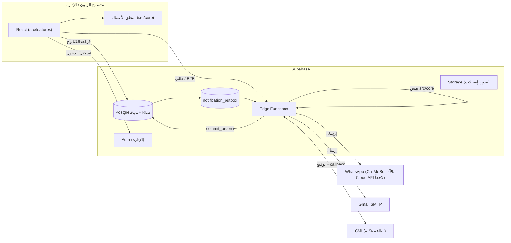
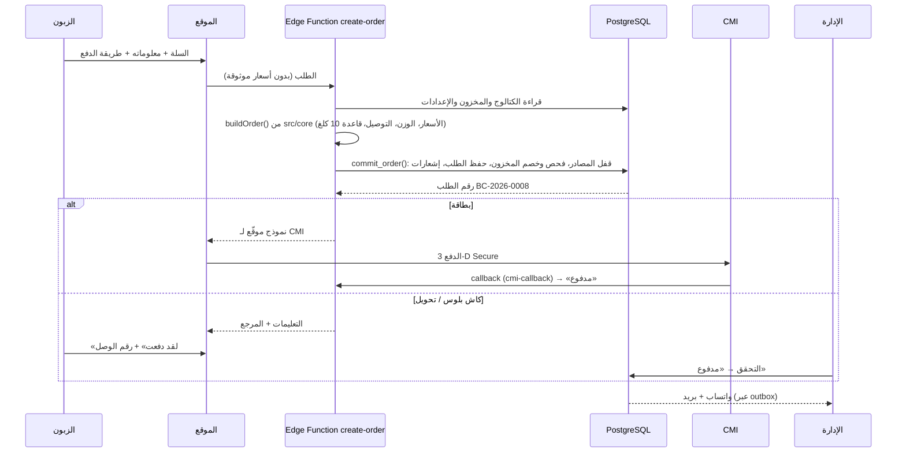

# 03 · البنية التقنية

## 1. الاختيارات ولماذا

| الطبقة | الاختيار | السبب |
|---|---|---|
| الواجهة | **React 19 + TypeScript + Vite** | الأكثر انتشاراً (سهل إيجاد مطوّر أو استعمال الذكاء الاصطناعي عليه)، سريع، وTypeScript يكشف الأخطاء قبل النشر |
| التنقل | React Router | مسار لكل صفحة: `/shop`, `/custom-blend`, `/admin/orders`… |
| التصميم | CSS عادي مع **متغيرات (tokens)** وخصائص منطقية (logical properties) | تغيير الألوان والخطوط من ملف واحد. العربية (RTL) تعمل تلقائياً دون ملفات CSS مكررة |
| اللغات | قواميس TypeScript (`ar.ts`, `fr.ts`, `en.ts`) | إذا نسيت ترجمة جملة، يرفض المشروع البناء. لا مكتبة إضافية |
| منطق الأعمال | `src/core` (TypeScript بدون React) | نفس الكود يعمل في المتصفح (السعر المباشر) وفي الخادم (التحقق النهائي). مُختبر آلياً (الكميات، الأحجام، الخلطة، الأسعار، المخزون، قواعد الحالة والدفع) |
| قاعدة البيانات والخادم | **Supabase**: PostgreSQL + Auth + Storage + Edge Functions | قاعدة بيانات حقيقية، أمان على مستوى الصفوف (RLS)، تسجيل دخول الإدارة، تخزين الصور وإيصالات الدفع، بدون خادم نديره بأنفسنا |
| الاستضافة | **Cloudflare Workers** (ملفات ثابتة فقط، `wrangler.jsonc`: المجلد `./dist` وكل رابط مجهول يعطي `index.html`؛ wrangler 4.148.0 مثبّت). Workers Builds ينشر `main` تلقائياً. إعدادات اللوحة (صاحب المشروع): Build command `npm run build`، Deploy command `npx wrangler deploy`. المعاينات (فروع غير `main`) تفشل في كل فرع: معروف، يُتجاهل حتى مرحلة التصميم ويُقرَّر هناك | الموقع ملفات ثابتة. سبب فشل المعاينة خلل في Workers Builds ([workers-sdk#15682](https://github.com/cloudflare/workers-sdk/issues/15682)): "name must match" رغم أن الاسم `boga-cafe`. الأمر `env -u WRANGLER_CI_MATCH_TAG …` محفوظ في Previews Base لكنه **غير مستعمل**: هذا الـ Worker على نموذج المعاينة القديم الذي يشغّل `npx wrangler versions upload` كما هو (البناء 9322a28f)، والحل هو Worker Previews (لا رجعة فيه، يُقرَّر في مرحلة التصميم). الإنتاج لا يتأثر. `vercel.json` و`api/notify.ts` بقايا من خطة Vercel: الدالة لا تعمل على Cloudflare (الرسائل من Supabase، المرحلة 4) |
| الاختبارات | Vitest (منطق الأعمال) + اختبار SQL على PostgreSQL + Playwright (تصفح آلي) | |

### لماذا ليس Shopify أو WooCommerce؟

الخلطة الخاصة **مع خصم المخزون بالغرام من كل مصدر** وقاعدة 10 كلغ وكيس 1 كلغ المحصور في طلبات B2B: كلها منطق خاص جداً. في Shopify/WooCommerce ستحتاج إضافات مدفوعة متعددة وتعديلات هشّة، وتبقى محدوداً. البناء الخاص يعطي تحكماً كاملاً بتكلفة تشغيل أقل.

### ملاحظة عن SEO

الموقع حالياً تطبيق صفحة واحدة (SPA). للظهور الجيد في Google، المرحلة 5 تضيف **توليد صفحات HTML مسبقاً** (Prerendering) لصفحات المتجر والمنتجات بثلاث لغات، مع `sitemap.xml` ووسوم `hreflang`. لأن منطق الأعمال منفصل تماماً عن الواجهة، يمكن أيضاً نقل صفحات المتجر إلى Next.js لاحقاً دون إعادة كتابة المنطق.

## 2. المخطط العام



## 3. مسار الطلب في الإنتاج (المرحلة 2–4)



### دورة حياة الطلب والدفع (مطبّقة في `src/core/orderFlow.ts` و `order.ts`، ونفسها في SQL)

المخزون يُحجز عند الطلب مباشرة (حتى لا يبيع زبونان نفس الكيلو الأخير). بعد ذلك:

| الحالة | من يغيّرها | المخزون |
|---|---|---|
| **في انتظار الدفع** (`pending`) | النظام عند الطلب | محجوز، يُحرَّر بعد 48 ساعة من الطلب |
| **أعلن الزبون الدفع** (`awaiting_verification`) | الزبون («لقد دفعت» + المرجع)، مرة أخرى بعد رفض | محجوز، يُحرَّر بعد 120 ساعة من الطلب إن لم يُؤكَّد. **ليس دفعاً**: مجرد طلب للتحقق |
| **لم يُعثر على الدفع** (`failed`) | المالك | محجوز حتى نفس الأجل (48 ساعة من الطلب)؛ يستطيع الزبون إعادة الإعلان |
| **مدفوع** (`paid`) | **المالك وحده**، بعد رؤية المبلغ مُضافاً في الحساب (الوصل أو المرجع لا يكفي) | ملتزم به: لا ينتهي، ولا يُلغى إلا بالاسترجاع |
| **مُسترجع** (`refunded`) | المالك | قبل الإنتاج: الطلب يُلغى ويعود المخزون |
| **في الإنتاج / شُحن / سُلِّم** | الفريق، فقط بعد «مدفوع» | استُهلك نهائياً |
| **ملغى** (يدوياً أو آلياً) | الفريق (غير مدفوع)، المالك (معلن الدفع)، أو النظام عند انتهاء الأجل | يعود مرة واحدة فقط |

الأجلان يُحسبان من وقت الطلب، فإعادة الإعلان لا تمدّد الحجز، ولا إعداد يوقفهما (أقل من ساعة = مرفوض، وغياب الإعداد = القيمة الافتراضية).

**الإعلان، التحقق، الاستقرار، الإنجاز:** «لقد دفعت» إعلان من الزبون؛ التحقق = المالك يرى المبلغ في الحساب ويسجّل «مدفوع»؛ الاستقرار النهائي للمال (هل يمكن سحب التحويل خلال مدة ما بعد وصوله؟) **قرار مفتوح** عند صاحب المشروع والبنك (`docs/07`، Q23): لا يوجد أي ربط آلي مع بنك أو كاش بلوس، ولا يُفترض شيء؛ الإنجاز = التسليم.

**معلومات الدفع:** اسم صاحب الحساب والبنك و RIB للتحويل، واسم المستفيد لكاش بلوس، في الإعدادات (المالك وحده يغيّرها، `guard_settings`). في الموقع الحقيقي هي فارغة، فالطريقتان غير معروضتين وقاعدة البيانات ترفض الطلب بهما. عند فتح الحساب الحقيقي يكفي إدخالها في «المدفوعات» (مع قاعدة البيانات، المرحلة 2): لا تغيير في الكود.

## 4. تنظيم الكود (كل قسم في مجلده)

```
src/
  core/              منطق الأعمال فقط — لا React، لا متصفح
    types.ts           نموذج البيانات
    pricing.ts         الأسعار + سعر الخلطة الخاصة
    blend.ts           قواعد الخلطة الخاصة (100%، الحد الأدنى، المخزون…)
    stock.ts           حساب الكيلوغرامات، النقص، الخصم والإرجاع
    cart.ts            السلة + قاعدة B2B
    shipping.ts        تكلفة التوصيل
    order.ts           بناء الطلب والتحقق منه
    __tests__/         اختبارات تلقائية
  data/              مكان البيانات (الوحيد الذي يعرف أين تُخزّن)
    seed/              الكتالوج والمدن والإعدادات (معلومات الدفع فارغة حتى الحساب الحقيقي)؛
                       activity.ts: طلبات أمثلة ومعلومات دفع DÉMO للنسخة التجريبية فقط
    mode.ts            أي نسخة: التجريبية (VITE_DATA_MODE=demo) أو الموقع الحقيقي
    types.ts           عقد Api: كل العمليات غير متزامنة (placeOrder, requestQuote, adjustStock…)
    api.ts, hooks.ts   طريق الصفحات إلى البيانات (tests/architecture.test.ts يمنع استيراد مزوّد مباشرة)
    backend.ts         يختار مكان البيانات حسب VITE_DATA_MODE
    demo/              قاعدة بيانات المتصفح (store.ts) وقواعدها (api.ts)
    supabase/          مع VITE_DATA_MODE=supabase: الكتالوج الحي (store.ts)، الطلبات وطلبات B2B عبر دالة storefront (storefront.ts)
  services/          الخدمات الخارجية كمحوّلات (adapters)
    payments/          بطاقة / كاش بلوس / تحويل
    notifications/     قوالب رسائل واتساب والبريد
  i18n/              اللغات الثلاث
  shared/            مكونات مشتركة: الكيس، الأعلام، الأيقونات، الرأس والتذييل
  features/          الأقسام — كل قسم مستقل
    home/sections/     أقسام الصفحة الرئيسية (كل قسم ملف)
    shop/ product/ single-origin/ custom-blend/ b2b/ cart/ checkout/ contact/
    admin/             لوحة الإدارة، كل قسم مجلد
  styles/            الألوان والخطوط (tokens.css) والأساسيات
supabase/
  migrations/        مخطط قاعدة البيانات للإنتاج
  tests/             اختبار المخطط على PostgreSQL
docs/                هذه الوثائق
```

**الهدف:** الصفحات لا تعرف أين تُخزّن البيانات، وتستعمل فقط `api` و `hooks`.

**الواقع اليوم:** عقد `Api` غير متزامن موجود (P5، الشريحة 1)، وأزرار الحفظ في الإدارة تنتظر عمليتها (واحدة في كل مرة، `useAction`). الحقول التي تحفظ مع كل حرف أو مفتاح (التوصيل، ملاحظات B2B، مفتاح الخلطة في المخزون) لم تُعدَّل بعد: تُصلَح قبل كتابات Supabase (الشرائح 8–10). الصفحات ما زالت تقرأ كل البيانات دفعة واحدة (`useDb()`): مزوّد Supabase سيملأ نفس `DbState` في الذاكرة (قرار المالك 2026-10-05). صفحة الطلب تقرأ هاتف وعنوان الزبون اللذين لا يعيدهما `get_order_public` عمداً: تُحفظ نسخة الطلب الذي أعاده `storefront` في المتصفح (sessionStorage، الشريحة 3)؛ وإن فُتح الرابط من جهاز آخر تُقرأ الحالة من `get_order_public` بدون رسالة للإرسال.

## 5. الأمان

| الخطر | الحماية |
|---|---|
| تغيير السعر من المتصفح | **قاعدة البيانات تعيد حساب كل رقم في الطلب** (`check_order`: السعر، الحجم، الكمية، الوزن، 10 كلغ، التوصيل، طريقة الدفع، المخزون) ولا تثق في أي رقم يأتي من المتصفح؛ مختبرة بطلبات مزوّرة (الفحص 22) وبطلبات يبنيها `src/core` (`supabase/tests/parity.sql`). دالة `create-order` (المرحلة 2، ربط Supabase) تبني الطلب بـ `src/core` قبل ذلك |
| بيع أكثر من المخزون | `commit_order()` يقفل صفوف المصادر داخل عملية واحدة (مُختبر) |
| بيع منتج أحد مصادره فارغ أو موقوف | المنتج «غير متاح» بكل أحجامه (`isProductAvailable` في `src/core/stock.ts`، قرار المالك 2026-10-06): لا يُضاف للسلة، والسلة التي تحتويه لا يرسلها الموقع لا كطلب ولا كطلب B2B؛ الخادم يرفض الطلب بـ `unavailable` بدون أي سطر، أما طلب B2B مصنوع يدوياً فيُحفظ بدون ذلك السطر (الشريحة 3b، مُختبر) |
| طلب مكرّر بعد جواب ضائع | مفتاح `idempotency_key` لكل إرسال (نفس المفتاح عند إعادة نفس الإرسال)، فريد في `orders`: `commit_order` يكتب سطر الطلب قبل المخزون ويعيد الطلب المحفوظ بدل حفظ طلب ثانٍ، حتى لو وصل الطلبان في نفس اللحظة أو أخذ الأول آخر الكيلوغرامات (الفحص 27 و `race.sh`). الموقع يحتفظ بالمفتاح يوماً واحداً على الأكثر. طلب بدون مفتاح يمرّ كما من قبل. طلبات B2B بدون مفتاح بعد (لا تحجز مخزوناً) |
| قراءة طلبات الآخرين | RLS: الزائر يقرأ الكتالوج فقط؛ صفحة الطلب عبر معرّف UUID غير قابل للتخمين |
| موظف يغيّر الأسعار | RLS حسب الدور (مُختبر: الموظف لا يستطيع) |
| دفع مزوّر بالبطاقة | مخطط (الخطوة D، غير مبني): الحالة «مدفوع» تأتي فقط من callback موقّع من CMI. حتى ذلك البطاقة **معطّلة** في الموقع الحقيقي |
| «لقد دفعت» بمرجع مزوّر | الإعلان لا يغيّر إلا «في انتظار التحقق»؛ **المالك وحده** يسجّل «مدفوع» (`set_payment_status`) بعد رؤية المبلغ في الحساب، ولا إنتاج قبل «مدفوع» (مُختبر، الفحص 9 و 23) |
| حجز المخزون للأبد (طلبات لا تُدفع) | كل حجز ينتهي: 48 ساعة بدون دفع، 120 ساعة إذا أعلن الزبون الدفع ولم يُؤكَّد، محسوبة من وقت الطلب؛ لا إعداد يوقفها (`expire_unpaid_orders`، الفحص 23). حد للطلبات المفتوحة لكل هاتف غير مبني بعد (المرحلة 2) |
| موظف يلغي طلباً مدفوعاً | الطلب المدفوع لا يُلغى إلا بالاسترجاع (المالك)، والذي أعلن الزبون دفعه لا يلغيه إلا المالك (`set_order_status`، مُختبر) |
| الدفع إلى حساب غير موجود | معلومات الدفع فارغة في الموقع الحقيقي؛ التحويل وكاش بلوس مغلقان، وقاعدة البيانات ترفض الطلب بهما حتى إدخال المعلومات الحقيقية (`invalid_order:payment_details`) |
| السبام في الاستمارات | Cloudflare Turnstile + حد للطلبات لكل هاتف (المرحلة 2) |
| المفاتيح السرية | في متغيرات بيئة الخادم (Supabase secrets)، أبداً في الكود أو في المتصفح |
| كلمات مرور الإدارة | مخطط: Supabase Auth مع التحقق بخطوتين للمالك (المرحلة 2). اليوم: لوحة الإدارة وكلمة سرها التجريبية موجودتان في النسخة التجريبية فقط، والموقع الحقيقي بدونها (`check:real-build`) |

## 6. الأداء

- لوحة الإدارة تُحمّل فقط عند فتح `/admin` (Lazy loading): زائر المتجر لا يحمّل كودها.
- الصور: تحويلها إلى WebP/AVIF بأحجام متعددة عند رفعها (المرحلة 5).
- الخطوط: ✅ مستضافة ذاتياً (`src/styles/fonts.css`، WOFF2 فقط، عربي + لاتيني حسب الحاجة) بدلاً من Google Fonts: أسرع وأفضل للخصوصية.

## 7. البناء والتشغيل

```bash
npm install
npm run dev          # تشغيل محلي
npm test             # اختبارات منطق الأعمال
npm run typecheck    # فحص الأنواع
npm run build        # نسخة الإنتاج → dist/
npm run build:demo   # النموذج في ملف HTML واحد → dist-demo/index.html
./supabase/tests/run-local.sh   # اختبار مخطط قاعدة البيانات (يتطلب PostgreSQL)
```

متغيرات البيئة: انظر `.env.example`. `VITE_DATA_MODE=demo` للنموذج، و`supabase` في المرحلة 2.
