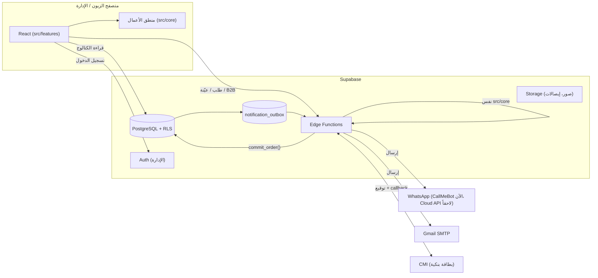
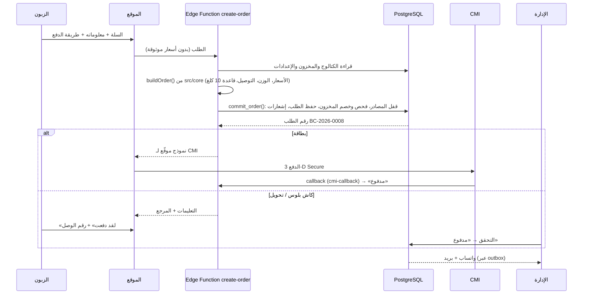

# 03 · البنية التقنية

## 1. الاختيارات ولماذا

| الطبقة | الاختيار | السبب |
|---|---|---|
| الواجهة | **React 19 + TypeScript + Vite** | الأكثر انتشاراً (سهل إيجاد مطوّر أو استعمال الذكاء الاصطناعي عليه)، سريع، وTypeScript يكشف الأخطاء قبل النشر |
| التنقل | React Router | مسار لكل صفحة: `/shop`, `/custom-blend`, `/admin/orders`… |
| التصميم | CSS عادي مع **متغيرات (tokens)** وخصائص منطقية (logical properties) | تغيير الألوان والخطوط من ملف واحد. العربية (RTL) تعمل تلقائياً دون ملفات CSS مكررة |
| اللغات | قواميس TypeScript (`ar.ts`, `fr.ts`, `en.ts`) | إذا نسيت ترجمة جملة، يرفض المشروع البناء. لا مكتبة إضافية |
| منطق الأعمال | `src/core` (TypeScript بدون React) | نفس الكود يعمل في المتصفح (السعر المباشر) وفي الخادم (التحقق النهائي). مُختبر آلياً (الكميات، الأحجام، الخلطة، الأسعار، المخزون، قواعد الحالة والدفع) |
| قاعدة البيانات والخادم | **Supabase**: PostgreSQL + Auth + Storage + Edge Functions | قاعدة بيانات حقيقية، أمان على مستوى الصفوف (RLS)، تسجيل دخول الإدارة، تخزين الصور وإيصالات الدفع، بدون خادم نديره بأنفسنا |
| الاستضافة | **Vercel** (مُجهّز الآن: `vercel.json` + دالة `api/notify.ts`؛ Cloudflare Pages بديل بنقل ملف واحد) | الموقع ملفات ثابتة + دالة واحدة. **تحقّقنا (شتنبر 2026):** خطة Vercel المجانية (Hobby) للاستعمال الشخصي غير التجاري فقط، والمتجر يحتاج خطة Pro (20$ شهرياً لكل عضو). Cloudflare Pages مجاني للاستعمال التجاري، مقابل نقل `api/notify.ts` |
| الاختبارات | Vitest (منطق الأعمال) + اختبار SQL على PostgreSQL + Playwright (تصفح آلي) | |

### لماذا ليس Shopify أو WooCommerce؟

الخلطة الخاصة **مع خصم المخزون بالغرام من كل مصدر** وقاعدة 10 كلغ وتدفق العيّنات: كلها منطق خاص جداً. في Shopify/WooCommerce ستحتاج إضافات مدفوعة متعددة وتعديلات هشّة، وتبقى محدوداً. البناء الخاص يعطي تحكماً كاملاً بتكلفة تشغيل أقل.

### ملاحظة عن SEO

الموقع حالياً تطبيق صفحة واحدة (SPA). للظهور الجيد في Google، المرحلة 5 تضيف **توليد صفحات HTML مسبقاً** (Prerendering) لصفحات المتجر والمنتجات بثلاث لغات، مع `sitemap.xml` ووسوم `hreflang`. لأن منطق الأعمال منفصل تماماً عن الواجهة، يمكن أيضاً نقل صفحات المتجر إلى Next.js لاحقاً دون إعادة كتابة المنطق.

## 2. المخطط العام



## 3. مسار الطلب في الإنتاج (المرحلة 2–4)



## 4. تنظيم الكود (كل قسم في مجلده)

```
src/
  core/              منطق الأعمال فقط — لا React، لا متصفح
    types.ts           نموذج البيانات
    pricing.ts         الأسعار + سعر الخلطة الخاصة
    blend.ts           قواعد الخلطة الخاصة (100%، الحد الأدنى، المخزون…)
    stock.ts           حساب الكيلوغرامات، النقص، الخصم والإرجاع
    cart.ts            السلة + قاعدة B2B
    shipping.ts        تكلفة التوصيل
    order.ts           بناء الطلب والتحقق منه
    __tests__/         اختبارات تلقائية
  data/              مكان البيانات (الوحيد الذي يعرف أين تُخزّن)
    seed/              البيانات التجريبية (المنتجات، المدن، الإعدادات، طلبات أمثلة)
    store.ts           قاعدة بيانات النموذج (في المتصفح)
    api.ts             كل العمليات: placeOrder, requestSample, adjustStock…  ← تُستبدل بـ Supabase
    hooks.ts           قراءة البيانات في الصفحات
  services/          الخدمات الخارجية كمحوّلات (adapters)
    payments/          بطاقة / كاش بلوس / تحويل
    notifications/     قوالب رسائل واتساب والبريد
  i18n/              اللغات الثلاث
  shared/            مكونات مشتركة: الكيس، الأعلام، الأيقونات، الرأس والتذييل
  features/          الأقسام — كل قسم مستقل
    home/sections/     أقسام الصفحة الرئيسية (كل قسم ملف)
    shop/ product/ single-origin/ custom-blend/ b2b/ cart/ checkout/ contact/
    admin/             لوحة الإدارة، كل قسم مجلد
  styles/            الألوان والخطوط (tokens.css) والأساسيات
supabase/
  migrations/        مخطط قاعدة البيانات للإنتاج
  tests/             اختبار المخطط على PostgreSQL
docs/                هذه الوثائق
```

**القاعدة الذهبية:** الصفحات لا تعرف أين تُخزّن البيانات. تستعمل فقط `api` و `hooks`. لذلك الانتقال من النموذج إلى Supabase = تغيير `src/data` فقط.

## 5. الأمان

| الخطر | الحماية |
|---|---|
| تغيير السعر من المتصفح | **قاعدة البيانات تعيد حساب كل رقم في الطلب** (`check_order`: السعر، الحجم، الكمية، الوزن، 10 كلغ، التوصيل، طريقة الدفع، المخزون) ولا تثق في أي رقم يأتي من المتصفح؛ مختبرة بطلبات مزوّرة (الفحص 22) وبطلبات يبنيها `src/core` (`supabase/tests/parity.sql`). دالة `create-order` (المرحلة 2، ربط Supabase) تبني الطلب بـ `src/core` قبل ذلك |
| بيع أكثر من المخزون | `commit_order()` يقفل صفوف المصادر داخل عملية واحدة (مُختبر) |
| قراءة طلبات الآخرين | RLS: الزائر يقرأ الكتالوج فقط؛ صفحة الطلب عبر معرّف UUID غير قابل للتخمين |
| موظف يغيّر الأسعار | RLS حسب الدور (مُختبر: الموظف لا يستطيع) |
| دفع مزوّر بالبطاقة | الحالة «مدفوع» تأتي فقط من callback موقّع من CMI، يُتحقق من توقيعه في الخادم |
| السبام في الاستمارات | Cloudflare Turnstile + حد للطلبات لكل هاتف (المرحلة 2) |
| المفاتيح السرية | في متغيرات بيئة الخادم (Supabase secrets)، أبداً في الكود أو في المتصفح |
| كلمات مرور الإدارة | Supabase Auth، مع تفعيل التحقق بخطوتين للمالك |

## 6. الأداء

- لوحة الإدارة تُحمّل فقط عند فتح `/admin` (Lazy loading): زائر المتجر لا يحمّل كودها.
- الصور: تحويلها إلى WebP/AVIF بأحجام متعددة عند رفعها (المرحلة 5).
- الخطوط: ✅ مستضافة ذاتياً (`src/styles/fonts.css`، WOFF2 فقط، عربي + لاتيني حسب الحاجة) بدلاً من Google Fonts: أسرع وأفضل للخصوصية.

## 7. البناء والتشغيل

```bash
npm install
npm run dev          # تشغيل محلي
npm test             # اختبارات منطق الأعمال
npm run typecheck    # فحص الأنواع
npm run build        # نسخة الإنتاج → dist/
npm run build:demo   # النموذج في ملف HTML واحد → dist-demo/index.html
./supabase/tests/run-local.sh   # اختبار مخطط قاعدة البيانات (يتطلب PostgreSQL)
```

متغيرات البيئة: انظر `.env.example`. `VITE_DATA_MODE=demo` للنموذج، و`supabase` في المرحلة 2.
